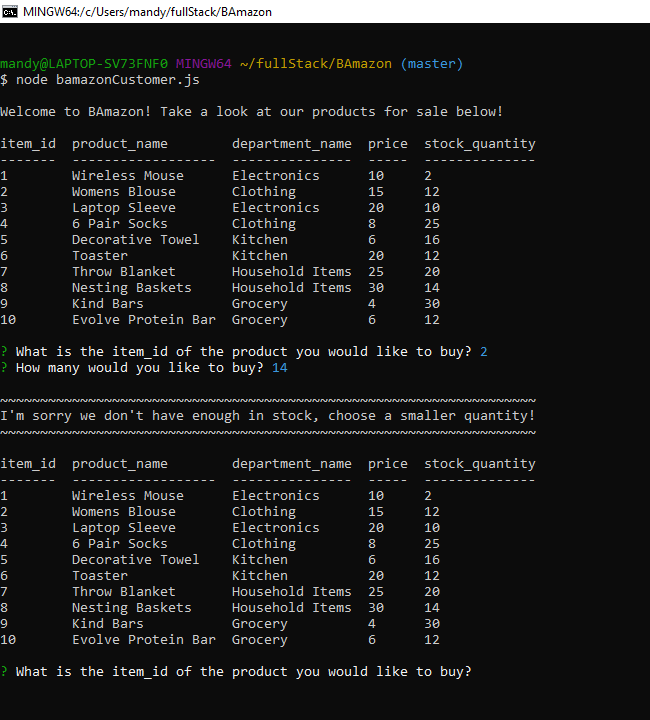

# BAmazon
Node.js and MySQL - Homework

## Notes:
This app BAmazon is a using a MySQL database and node to query the database and place orders using prompts, user input, and updating tables.

## First Screenshot
See first screenshot from the application showing the table of products available for purchase. This used the console.table npm package to display the table of products from MySQL database. Then uses the inquirer npm package to prompt user. If the user chooses a larger quantity than what is in stock, the user must choose a different quantity.

## Second Screenshot
Second screenshot displays a proper order with sufficient quantities being placed which uses the mysql npm package to query the database. Calculates cost with quantity order and returns total cost to the console.

## Third Screenshot
Third screenshot is when the user is prompted to start a new order. If selected yes, all products for sale will display and be prompted to select again. If selected no, connection to database ends and console will display thanks for shopping.

